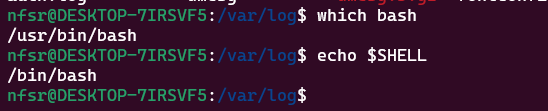
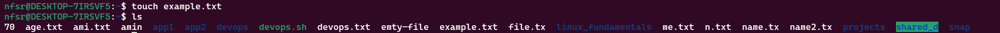

# Linux Tasks Repository

## Overview
This repository contains shell commands for completing common Linux tasks, along with screenshots of their outputs.

## File Structure
- `scripts/linux_tasks.sh`: Contains all the Linux commands.
- `Screenshots/`: Contains screenshots of the command outputs.
## Make the Script Executable
-- chmod +x linux_task.sh
## Run the Script

-- ./linux_tasks.sh
 
## Tasks
### File System Navigation
1. **List the contents of the home directory**:

   

2. **Change the current directory to /var/log and list its contents**:

   

3. **Finding bash executable path**:

    

4. **Finding current shell**:

    

5. **File and Directory Operations**:

    Creating a directory name `linux-fundamentals` 

    

    Under the directory creating a another directory named `scripts`
    
    

    Under the directory created a `.txt` file `named example.txt`

    

    Copied `linux_fundamentals/example.txt` to `linux_fundamentals/scripts`
    
    

    Created a `backup` folder under `linux_fundamentals` and moved `linux_fundamentals/example.txt` file to `linux_fundamentals/backup ` folder using `mv` command

    

    Change the permissions of `example.txt` to read and write for the owner, and read-only for the group and others.Verify the permission changes using `ls -l`

    

6. **File-Modification**:
    Creating a user name `student`

    

    Creating a `exaple.txt` file using `touch` command
    

    `sudo chown student example.txt` Changes the owner of the file to the user `student`

    

    Change `group` using command `chgrp`

    

7. **Ownership**:

    Create a directory named `project` in the `home directory`

    
    

    
    Create a file named `report.txt` inside the `project` directory

    

    Set permissions of `report.txt` to read and write for the owner, and read-only for the group and others
    
    
    
    Set permissions of the `project` directory to read, write, and execute for the owner, and read and execute for the group and others

     
    
    
    Verify the `permission` changes

    

7. **UserAdd/Modify**:

    Creating a new user name `developer` and making a custom home directory name `developer_home` 
    
    
    
    Modifying username `developer` to `devuser`

    

    Creating a new group name `devgroup` and adding `user` on that group

    

    

    Set new password and verifying `user`

    

8. **Soft/Hard link**:

    Created several files and checking `softlink/hardlink` & their `i-nodes` and observed what happend after deleting that files. After that useing `find` command to find `.txt` file

     

9. **Package_Installation**

    Atfirst tried `apt-update` then I installed a package named `tree` after that  I installed GCP CLI 
    
    

    

    Checking version of both `tree` & `Gcloud_CLI`

    
